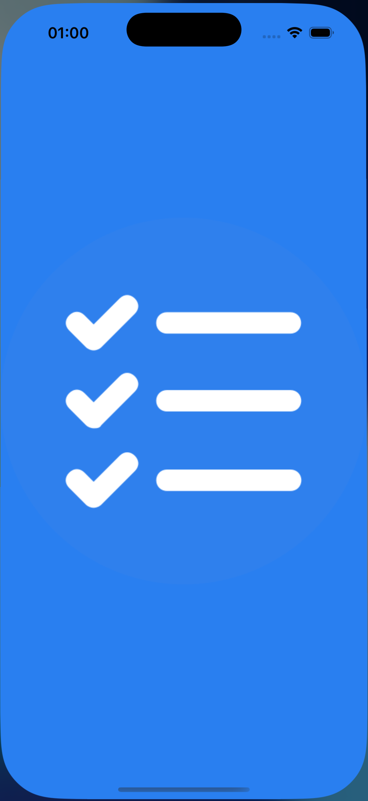
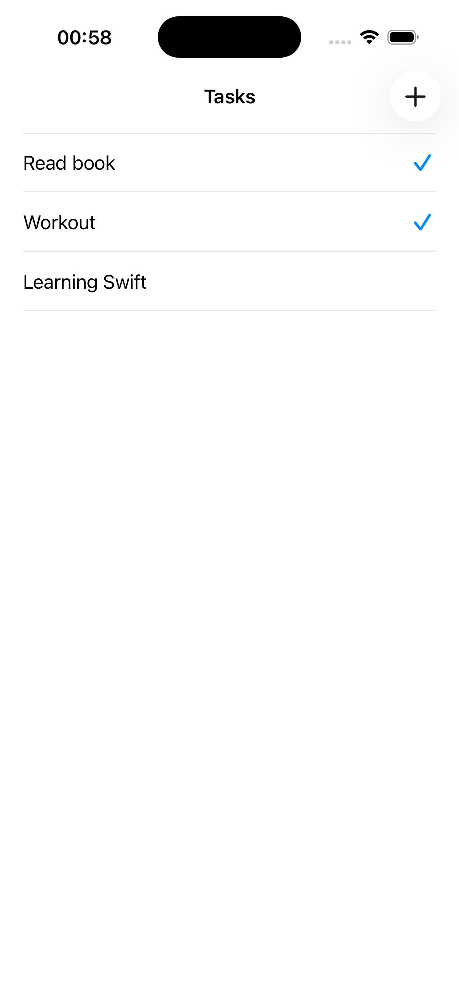
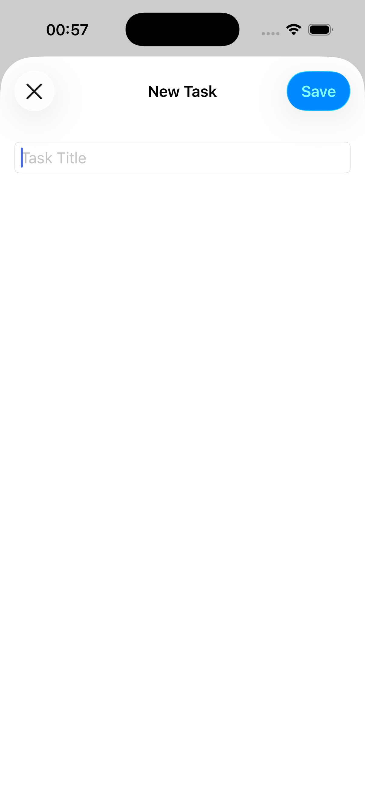

# Tasks App

Simple iOS tasks application built with UIKit and CoreData.

## Features
- Create and delete tasks
- Persistent storage using CoreData
- Clean UIKit architecture

## Tech Stack
- Swift
- UIKit
- CoreData

## Screenshots

  
  
  

## About
Pet project created to practice UIKit, CoreData, and app architecture basics.
